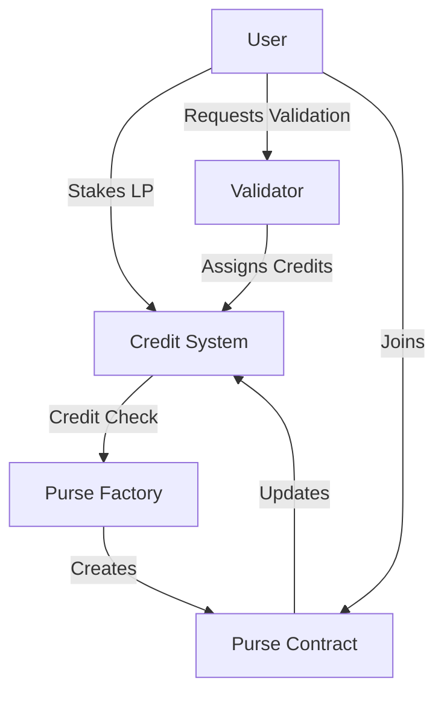
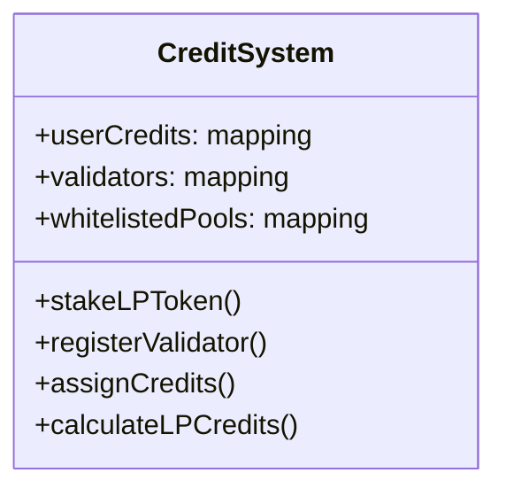
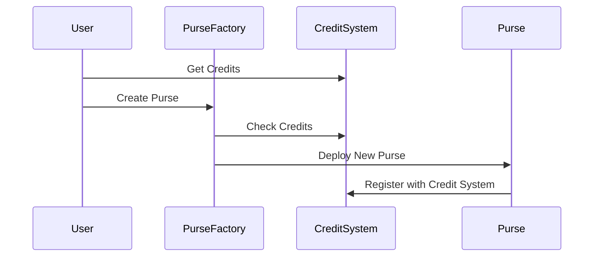
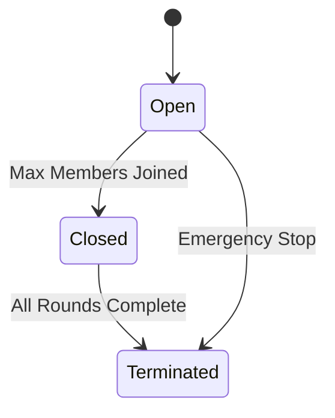
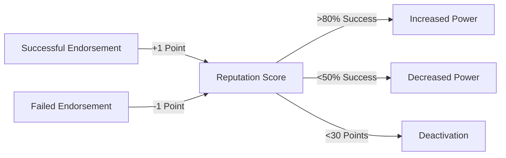
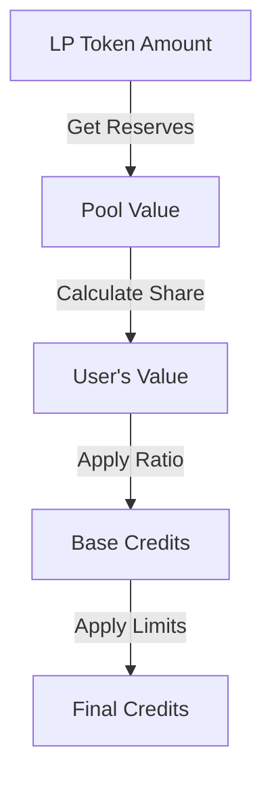
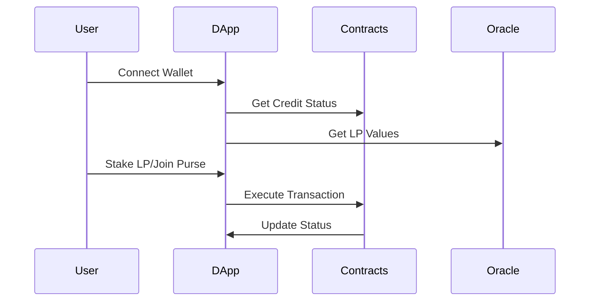

# Technical Documentation

## System Architecture

## Contract Specifications

### 1. CreditSystem.sol
The central contract managing credit scores and validator governance.

#### Key Components:
- Credit Tracking
- Validator Management
- LP Staking
- Price Oracle Integration

#### Credit Mechanisms:
1. **LP Staking**
   - Users stake LP tokens from whitelisted pools
   - Credits = LP Value × Credit Ratio
   - Time-locked positions
   
2. **Validator Endorsement**
   - Validators stake USDC/USDT
   - Can assign credits up to validation power
   - Reputation affects credit assignment power

3. **Administrative Assignment**
   - Owner can assign credits to validators
   - Used for institutional integrations

### 2. PurseFactory.sol
Factory contract for creating new thrift groups.

#### Features:
- Purse creation with credit requirements
- Member tracking
- Chat ID integration
- Factory pattern implementation

### 3. Purse.sol
Individual thrift group contract.

#### States:

#### Key Features:
- Position-based membership
- Automated round progression
- Credit requirement enforcement
- Donation tracking

## Validator System

### Reputation Mechanism

### Validator Economics
- Initial Stake: 10,000 USDC/USDT
- Fee Range: 0-10%
- Bonus Multiplier: 1x-2x
- Slashing Conditions:
  1. User defaults
  2. Low reputation
  3. Inactivity

## LP Staking Mechanism

### Credit Calculation

### Pool Parameters
- Credit Ratio: Pool-specific
- Minimum Stake Time
- Maximum Credit Limit
- Price Feed Requirements

## Security Features

### Credit System
1. **Access Control**
   - Ownable for admin functions
   - Validator requirements
   - Credit assignment limits

2. **Economic Security**
   - Validator stakes
   - Time locks
   - Reputation system

3. **Emergency Controls**
   - System pause
   - Credit freezing
   - Validator deactivation

### Purse Security
1. **Member Protection**
   - Position verification
   - Donation tracking
   - Credit requirements

2. **Fund Safety**
   - Direct transfers
   - Balance tracking
   - Emergency exits

## Integration Points

### External Systems
1. **Price Oracles**
   - Token price feeds
   - LP value calculation
   - Update frequency checks

2. **Token Standards**
   - ERC20 for tokens
   - LP token interfaces
   - Stable coin integration

### User Integration

## Error Handling

### Credit System Errors
- Insufficient credits
- Invalid validator status
- Price feed staleness
- LP token restrictions

### Purse Errors
- Position conflicts
- Membership limits
- Timing restrictions
- Donation requirements

## Upgrade Considerations

1. **Proxy Pattern**
   - Future upgrades
   - State preservation
   - Version control

2. **Data Migration**
   - Credit history
   - Validator status
   - LP positions

3. **Backward Compatibility**
   - Interface stability
   - Event compatibility
   - Function signatures 